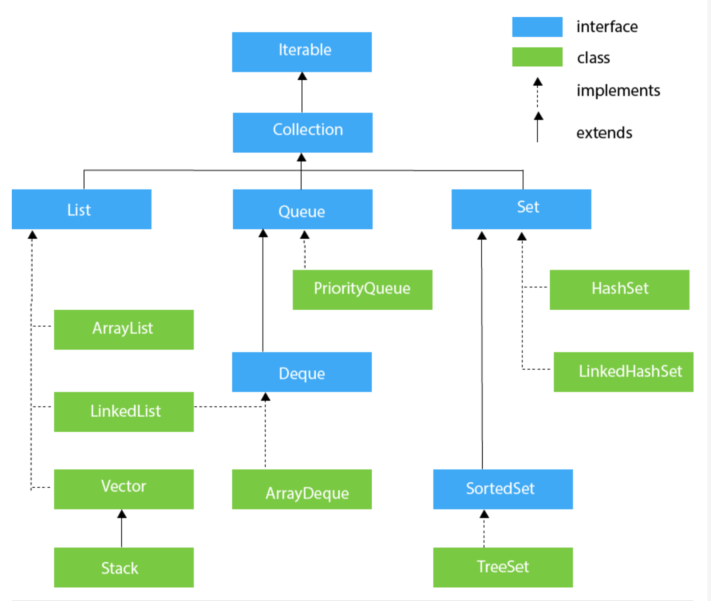

# Heirerchy of Java Collection Framework Tree

The Java.util package contains all the classes and interfaces of the collection framework. below is the tree structure of the collection framework. In blue we have interfaces and in green, we have classes that inherit the collections framework interface.

The collection framework itself demonstrates the power of the interface. Because all the classes are derived from the interfaces that will help you remember the methods of the collection framework.
